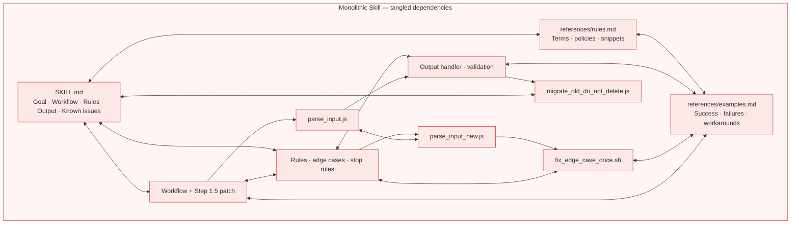
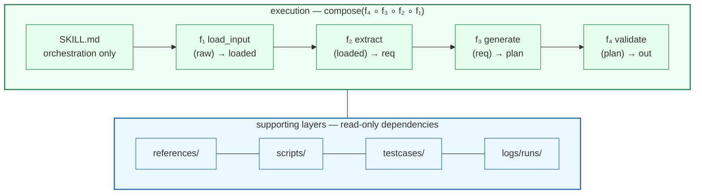

# Functional Skill Creator

> **Maintain Agent Skills with functional programming discipline.**

[中文版 README](docs/README.zh-CN.md)

Functional Skill Creator is an engineering methodology, **designed for complex Skill maintenance and iteration.**
Combined with trace logging and unit testing, it makes Skills **modular, traceable, and testable**:
- Treat each `Step` as a `Function` with explicit `Input/Output` (pure function first)
- `SKILL.md` only orchestrates the pipeline of `Function`s, consuming only `external inputs` and `reference dependencies`
- Shared rules across `Function`s go into `references/`
- Deterministic logic called by `Function`s becomes `scripts/`
- Add trace logging for every `Function`, running locally, recording input/output/token consumption/duration
- Equip every `Function` with unit tests and E2E tests, ensuring neither individual Functions nor the full pipeline regress

## Quick Start

The repository includes one main functional skill:

- `fskill-creator`: Unified skill for creating, maintaining, and migrating functional skills; internally contains create / migrate sub-skill lanes.

Install it with [skills.sh](https://skills.sh/) / the Skills CLI (works with Cursor, Claude Code, Codex, PromptScript, and [70+ agents](https://github.com/vercel-labs/skills#supported-agents)):

```bash
# Project install (default; required for PromptScript and some other agents)
npx skills add Shopee-Eng/functional-skill-creator --skill fskill-creator -y
```

Add `-g` only if your agent supports global install (for example Cursor or Claude Code). PromptScript does **not** support `-g` and will fail with `does not support global skill installation`.

To target specific agents, pass `-a` (repeatable), for example `-a cursor -a claude-code -a promptscript`.

Prefer letting your Agent use this Skill rather than maintaining a separate CLI logic:

```text
Use fskill-creator to create a functional skill for <workflow>.
```

```text
Use fskill-creator to migrate <path-to-existing-SKILL.md> into a functional skill.
```

When creating or migrating, pass `include_report` and `include_unittest` to control trace logging and test scaffolding (both enabled by default; set to `false` to disable).

`fskill-creator` itself is also a functional skill: the main `SKILL.md` only handles orchestration and routing, create / migrate pre-analysis lives in `sub-skills/`, shared artifact generation lives in main `functions/*.md`, shared rules live in `references/*.md`, and deterministic helpers live under `scripts/`. When someone installs or copies only the `fskill-creator` directory, none of its required scripts are missed.

When creating or migrating, you can choose whether to generate `tools/log_viewer.mjs` and `tools/tester_viewer.mjs`. If not explicitly specified, `fskill-creator` will explain the purpose of these two viewers and ask whether they are needed.

## Why

Your Skill is getting bloated.

As your Skill's capabilities iterate, your `SKILL.md` and `references/*.md` grow longer, rules pile up, edge cases get patched ever more finely — slowly turning into an unmaintainable wall of prose.

A typical example is when everything keeps getting stuffed into a handful of markdown files:

### Before: monolithic prose wall



Functional Skill Creator provides an engineering methodology that makes Skills **modular, traceable, and testable**:
- Break each step into a `Function` with explicit Input/Output
- `SKILL.md` only orchestrates the pipeline of `Function`s, consuming only `external inputs` and `reference dependencies`
- Shared rules across `Function`s go into `references/`
- Deterministic logic called by `Function`s becomes `scripts/`
- Add trace logging for every `Function`, running locally, recording input/output/token consumption/duration
- Equip every `Function` with unit tests and E2E tests, ensuring neither individual Functions nor the full pipeline regress

### After: observable functional pipeline



Functional Skill does not aim to make Skills complex, but to put complexity where it belongs: judgment goes to Functions, rules go into references, deterministic actions go to scripts, and regression behavior solidifies into testcases.


## When to Use

- You are maintaining a long-evolving agent skill and don't want to rely on gut feeling for every regression check.
- Your `SKILL.md` and `references/` have become impossible to maintain manually, leaving you no choice but to blindly let AI iterate down one path.
- You want to extract deterministic work like parsing, formatting, and validation from prompts and execute them reliably through scripts.
- You want your skill's functionality and execution flow to become traceable, so you can pinpoint exactly where each run went wrong.
- You want your skill to capture real failure cases and ideal runs, turning them into repeatable test suites.

In other words, if your Skill is concise, or you've already split it cleanly in a modular way and are confident it's maintainable — you don't need to make it Functional.

## Report Log and Unittest Capabilities

Skills generated by `fskill-creator` include basic report / unittest tooling by default. Use `include_report=false` and `include_unittest=false` to disable them separately, or use `include_viewers=true|false` to control whether local viewers are generated.

- `scripts/report.mjs`: Writes function-level report logs, supports `report_mode=off|local|remote`.
- `scripts/runtime.mjs`: Exports `runStep`, `writeStepReport`, and `applyReportMode` for wrapping each Step in the function workflow.
- `scripts/test_report.mjs`: Validates that the report runtime can write JSONL and checks sensitive field redaction.
- `scripts/test_cases.mjs`: Runs `testcases/**/*.case.json` function input/output assertions, and can also export trace records as testcases.
- `logs/runs/`: JSONL traces written when `report_mode=local`.

## Iteration Loop

Functional Skill encourages turning real execution traces into regression assets:

```text
Run skill → Check trace → Review function behavior → Export testcase → Fix function → Run tests
```

If `Function1` fails, add a testcase for `Function1`;
if `normalize_input` is deterministic logic, push it down into `scripts/` and write a script test.
Problems stay at the layer where they occur — maintenance cost does not spread across the entire skill.

See methodology details in [docs/functional-skill.md](docs/functional-skill.md). Function contract specification in [docs/function-contract.md](docs/function-contract.md). When to put logic into `scripts/` in [docs/scripting.md](docs/scripting.md). Testing and trace in [docs/testing.md](docs/testing.md) and [docs/observability.md](docs/observability.md).

## Repository Structure

```text
skills/
  fskill-creator/        Create, maintain, or migrate functional skills
    sub-skills/
      create/            Form create_context from requirement brief
      migrate/           Form migration_context from legacy SKILL.md
docs/                    Methodology and specifications
templates/               Reusable skill templates
examples/                Runnable functional skill examples
```

## Project Status

Currently `v0.1.0 alpha`. File formats and script conventions are usable, but may still adjust before 1.0.

This project does not bind to any agent platform, model vendor, or workflow engine. The built-in testcase runner is a runtime-agnostic assertion engine — it only validates output, does not execute agents or call models.

## Contributing

Issues and PRs welcome. See [CONTRIBUTING.md](CONTRIBUTING.md) for development guide. For security-sensitive submissions, please read [SECURITY.md](SECURITY.md) first.

## License

MIT. See [LICENSE](LICENSE).
