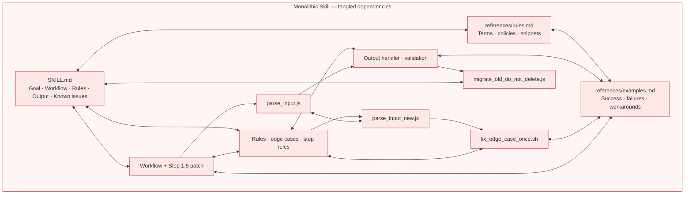
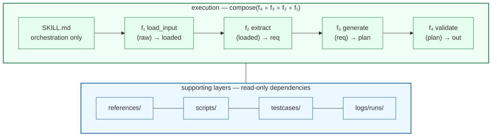

# Functional Skill Creator

> **用函数式编程的纪律来维护 Agent Skill。**

[English README](../README.md)

Functional Skill Creator 是一套工程方法论，**面向复杂 Skill 的维护与迭代。**
结合 trace 日志与单元测试，它让 Skill 变得**模块化、可追踪、可测试**：
- 把每个 `Step` 当作带明确 `Input/Output` 的 `Function`（优先纯函数）
- `SKILL.md` 只编排 `Function` 流水线，只消费 `external inputs` 与 `reference dependencies`
- 跨 `Function` 的共享规则放进 `references/`
- 由 `Function` 调用的确定性逻辑下沉为 `scripts/`
- 为每个 `Function` 增加 trace 日志，本地运行，记录 input/output/token 消耗/耗时
- 为每个 `Function` 配备单元测试与 E2E 测试，确保单个 Function 与整条流水线都不回归

## 快速开始

本仓库包含一个主 functional skill：

- `fskill-creator`：统一用于创建、维护与迁移 functional skill；内部包含 create / migrate 两条子 skill lane。

通过 [skills.sh](https://skills.sh/) / Skills CLI 安装（支持 Cursor、Claude Code、Codex 等 [70+ agent](https://github.com/vercel-labs/skills#supported-agents)）：

```bash
npx skills add Shopee-Eng/functional-skill-creator --skill fskill-creator -g -y
```

指定 agent 时可重复传入 `-a`，例如 `-a cursor -a claude-code`。

更推荐让 Agent 直接使用这个 Skill，而不是单独维护一套 CLI 逻辑：

```text
使用 fskill-creator，为 <workflow> 创建一个 functional skill。
```

```text
使用 fskill-creator，把 <path-to-existing-SKILL.md> 迁移成 functional skill。
```

创建或迁移时可传 `include_report` 与 `include_unittest` 控制 trace 日志与测试脚手架（默认开启，设为 `false` 可关闭）。

`fskill-creator` 本身也是 functional skill：主 `SKILL.md` 只负责编排与路由，create / migrate 前置分析在 `sub-skills/`，共享 artifact 生成在主 `functions/*.md`，共享规则在 `references/*.md`，确定性 helper 在 `scripts/` 下。只安装或复制 `fskill-creator` 目录时，不会漏掉它依赖的 scripts。

创建或迁移时，可以选择是否生成 `tools/log_viewer.mjs` 与 `tools/tester_viewer.mjs`。若未明确指定，`fskill-creator` 会说明这两个 viewer 的用途并询问是否需要。

## 为什么需要

你的 Skill 正在膨胀。

随着 Skill 能力不断迭代，`SKILL.md` 与 `references/*.md` 越来越长，规则越堆越多，edge case 补丁越打越细——慢慢变成难以维护的散文巨兽。

典型情况是，所有行为都塞进少数几个 markdown 文件：

### 之前：散文式巨兽



Functional Skill Creator 提供一套工程方法论，让 Skill **模块化、可追踪、可测试**：
- 把每一步拆成带明确 Input/Output 的 `Function`
- `SKILL.md` 只编排 `Function` 流水线，只消费 `external inputs` 与 `reference dependencies`
- 跨 `Function` 的共享规则放进 `references/`
- 由 `Function` 调用的确定性逻辑下沉为 `scripts/`
- 为每个 `Function` 增加 trace 日志，本地运行，记录 input/output/token 消耗/耗时
- 为每个 `Function` 配备单元测试与 E2E 测试，确保单个 Function 与整条流水线都不回归

### 之后：可观测的函数式流水线



Functional Skill 的目标不是把 Skill 做复杂，而是把复杂度放到该在的地方：判断交给 Functions，规则放进 references，确定性动作交给 scripts，回归行为固化成 testcases。

## 何时使用

- 你在维护一个长期演进的 agent skill，不想每次回归都靠直觉。
- 你的 `SKILL.md` 与 `references/` 已经难以手工维护，只能盲目让 AI 沿一条路径迭代。
- 你想把 parsing、formatting、validation 等确定性工作从 prompt 里抽出来，通过 scripts 可靠执行。
- 你希望 skill 的功能与执行流程可追踪，能精确定位每次运行在哪一步出错。
- 你希望 skill 能捕获真实失败案例与理想运行，并变成可重复的测试套件。

换句话说，如果你的 Skill 本身很简洁，或者你已经用模块化方式拆得很干净且确信可维护——不必强行 Functional 化。

## Report Log 与 Unittest 能力

`fskill-creator` 生成的 skill 默认自带基础 report / unittest 工具。可用 `include_report=false` 与 `include_unittest=false` 分别关闭，或用 `include_viewers=true|false` 控制是否生成本地 viewer。

- `scripts/report.mjs`：写 function 级 report log，支持 `report_mode=off|local|remote`。
- `scripts/runtime.mjs`：导出 `runStep`、`writeStepReport` 与 `applyReportMode`，供 function workflow 包裹每个 Step。
- `scripts/test_report.mjs`：验证 report runtime 能写入 JSONL，并检查敏感字段脱敏。
- `scripts/test_cases.mjs`：运行 `testcases/**/*.case.json` 中的 function input/output 断言，也可把 trace record 导出为 testcase。
- `logs/runs/`：`report_mode=local` 时写入 JSONL trace。

## 迭代闭环

Functional Skill 鼓励把真实执行 trace 变成回归资产：

```text
Run skill → Check trace → Review function behavior → Export testcase → Fix function → Run tests
```

若 `Function1` 失败，为 `Function1` 补 testcase；
若 `normalize_input` 是确定性逻辑，就下沉到 `scripts/` 并写 script test。
问题留在发生的层级——维护成本不会扩散到整个 skill。

方法论细节见 [functional-skill.md](functional-skill.md)。Function 契约规范见 [function-contract.md](function-contract.md)。何时把逻辑放进 `scripts/` 见 [scripting.md](scripting.md)。测试与 trace 见 [testing.md](testing.md) 与 [observability.md](observability.md)。

## 仓库结构

```text
skills/
  fskill-creator/        创建、维护或迁移 functional skill
    sub-skills/
      create/            从需求 brief 形成 create_context
      migrate/           从 legacy SKILL.md 形成 migration_context
docs/                    方法论与规范
templates/               可复用 skill 模板
examples/                可运行的 functional skill 示例
```

## 项目状态

当前为 `v0.1.0 alpha`。文件格式与 script 约定可用，但在 1.0 前仍可能调整。

本项目不绑定任何 agent 平台、模型厂商或 workflow 引擎。内置 testcase runner 是与 runtime 无关的断言引擎——只校验 output，不执行 agent 或调用模型。

## 贡献

欢迎 Issue 与 PR。开发指南见 [CONTRIBUTING.md](../CONTRIBUTING.md)。涉及安全敏感内容请先阅读 [SECURITY.md](../SECURITY.md)。

## 许可证

MIT。见 [LICENSE](../LICENSE)。
