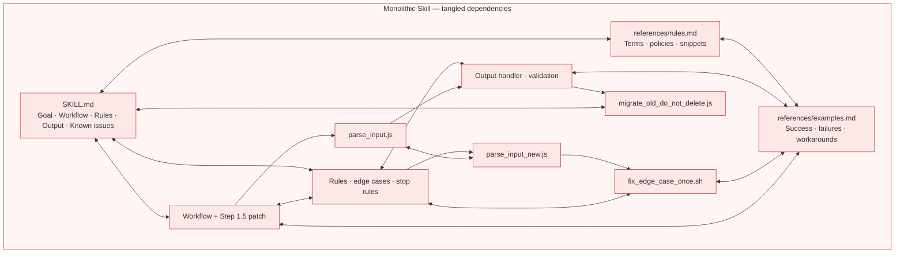
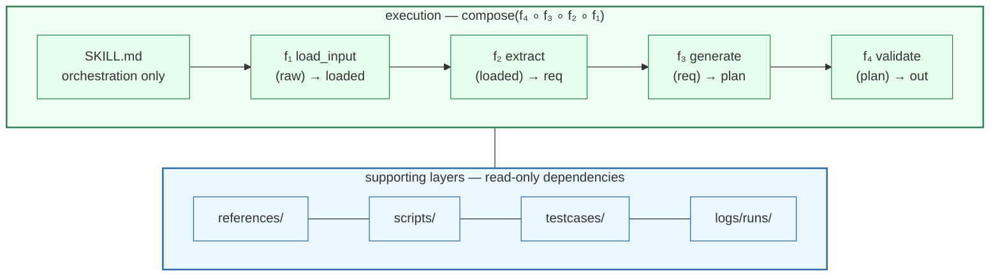

# Functional Skill Creator

> **用函数式编程的纪律来维护 Agent Skill。**

[English README](../README.md)

Functional Skill 是一套工程方法论，**面向复杂 Skill 的维护与迭代。结合 trace 日志与单元测试，它让 Skill 变得模块化、可追踪、可测试**：

- 把每个 `Step` 当作带明确 `Input/Output` 的 `Function`（优先纯函数）
- `SKILL.md` 只编排 `Function` 流水线，只消费 `external inputs` 与 `reference dependencies`
- 跨 `Function` 的共享规则放进 `references/`
- 由 `Function` 调用的确定性逻辑下沉为 `scripts/`
- 为每个 `Function` 增加 trace 日志，本地运行，记录 input/output/token 消耗/耗时
- 为每个 `Function` 配备单元测试与 E2E 测试，确保单个 Function 与整条流水线都不回归

## 快速开始

### 安装

```bash
npx skills add Shopee-Eng/functional-skill-creator --skill fskill-creator -y
```

通过 [skills.sh](https://skills.sh/) 安装。指定 agent 加 `-a <agent>`；仅当 agent 支持全局安装时再加 `-g`。

---

### 使用

**创建** — 从 workflow 描述新建 functional skill：

```text
/fskill-creator create a functional skill for <workflow>
```

**迁移** — 把现有 legacy skill 目录重构为 functional skill：

```text
/fskill-creator migrate <path-to-skill-dir>
```

migrate lane 会读取整个 skill 包——`SKILL.md`、`references/`、`scripts/` 及其他伴随文件——而不是只处理单个 markdown 文件。

可选参数：`include_report`、`include_unittest`、`include_viewers`（默认开启，设为 `false` 可关闭）。

## 为什么需要

你的 Skill 正在膨胀。

随着 Skill 能力不断迭代，`SKILL.md` 与 `references/*.md` 越来越长，规则越堆越多，edge case 补丁越打越细——慢慢变成难以维护的散文巨兽。

典型情况是，所有行为都塞进少数几个 markdown 文件：

### 之前：散文式巨兽




Functional Skill Creator 提供一套工程方法论，让 Skill **模块化、可追踪、可测试**：

- 把每一步拆成带明确 Input/Output 的 `Function`
- `SKILL.md` 只编排 `Function` 流水线，只消费 `external inputs` 与 `reference dependencies`
- 跨 `Function` 的共享规则放进 `references/`
- 由 `Function` 调用的确定性逻辑下沉为 `scripts/`
- 为每个 `Function` 增加 trace 日志，本地运行，记录 input/output/token 消耗/耗时
- 为每个 `Function` 配备单元测试与 E2E 测试，确保单个 Function 与整条流水线都不回归

### 之后：可观测的函数式流水线




Functional Skill 的目标不是把 Skill 做复杂，而是把复杂度放到该在的地方：判断交给 Functions，规则放进 references，确定性动作交给 scripts，回归行为固化成 testcases。

## 何时使用

- 你在维护一个长期演进的 agent skill，不想每次回归都靠直觉。
- 你的 `SKILL.md` 与 `references/` 已经难以手工维护，只能盲目让 AI 沿一条路径迭代。
- 你想把 parsing、formatting、validation 等确定性工作从 prompt 里抽出来，通过 scripts 可靠执行。
- 你希望 skill 的功能与执行流程可追踪，能精确定位每次运行在哪一步出错。
- 你希望 skill 能捕获真实失败案例与理想运行，并变成可重复的测试套件。

换句话说，如果你的 Skill 本身很简洁，或者你已经用模块化方式拆得很干净且确信可维护——不必强行 Functional 化。

## Report Log 与 Unittest 能力

`fskill-creator` 生成的 skill 默认自带基础 report / unittest 工具。可用 `include_report=false` 与 `include_unittest=false` 分别关闭，或用 `include_viewers=true|false` 控制是否生成本地 viewer。

- `scripts/report.mjs`：写 function 级 report log，支持 `report_mode=off|local|remote`。
- `scripts/runtime.mjs`：导出 `runStep`、`writeStepReport` 与 `applyReportMode`，供 function workflow 包裹每个 Step。
- `scripts/test_report.mjs`：验证 report runtime 能写入 JSONL，并检查敏感字段脱敏。
- `scripts/test_cases.mjs`：运行 `testcases/**/*.case.json` 中的 function input/output 断言，也可把 trace record 导出为 testcase。
- `logs/runs/`：`report_mode=local` 时写入 JSONL trace。

## 迭代闭环

Functional Skill 鼓励把真实执行 trace 变成回归资产：

```text
Run skill → Check trace → Review function behavior → Export testcase → Fix function → Run tests
```

若 `Function1` 失败，为 `Function1` 补 testcase；
若 `normalize_input` 是确定性逻辑，就下沉到 `scripts/` 并写 script test。
问题留在发生的层级——维护成本不会扩散到整个 skill。

方法论细节见 [functional-skill.md](functional-skill.md)。Function 契约规范见 [function-contract.md](function-contract.md)。何时把逻辑放进 `scripts/` 见 [scripting.md](scripting.md)。测试与 trace 见 [testing.md](testing.md) 与 [observability.md](observability.md)。

## 迁移会暴露什么

迁移会把 legacy skill 里原本就存在的结构性问题暴露出来，例如 I/O 对不上、步骤边界模糊、函数职责不清等。这是正常现象，不是迁移失败。review 提案、修正 contract、补 testcase 之后，skill 通常会比原来更稳定、更少 hallucination。

迁移不会制造新问题，只是把原来隐式存在的设计问题显式化。

散文式 skill 往往「能跑但靠默契」：后一步默认前一步已经产出了某字段，解析和判断混在一起，规则散落在多个章节。拆成 function contract 之后，这些假设必须写清楚，对不上的地方就会立刻露出来。

迁移后常见发现：

- **I/O 对不上** — 下游 function 期望的字段，上游没有定义 output
- **边界模糊** — 一个 legacy 段落对应多个 function，或单个 function 职责过重
- **定义含糊** — input/output 用散文描述，没有稳定字段

这些都属于迁移的正常产出，不是工具故障。建议流程：

1. review `migration_proposal` 和各 function contract
2. 对齐 pipeline I/O（改字段名、拆分或合并 function、补 `references/shared-glossary.md`）
3. 开 trace 跑一遍，把失败步骤导出为 testcase
4. 反复跑测试，直到 pipeline 一致

修这些问题才是迁移的价值。contract 清晰、有测试的 skill，比靠运气运行的散文巨兽更稳定、更少 hallucination。

## 仓库结构

```text
skills/
  fskill-creator/        创建、维护或迁移 functional skill
    sub-skills/
      create/            从需求 brief 形成 create_context
      migrate/           从 legacy skill 目录形成 migration_context
docs/                    方法论与规范
templates/               可复用 skill 模板
examples/                可运行的 functional skill 示例
```

## 项目状态

当前为 `v0.1.0 alpha`。文件格式与 script 约定可用，但在 1.0 前仍可能调整。

本项目不绑定任何 agent 平台、模型厂商或 workflow 引擎。内置 testcase runner 是与 runtime 无关的断言引擎——只校验 output，不执行 agent 或调用模型。

## 贡献

欢迎 Issue 与 PR。开发指南见 [CONTRIBUTING.md](../CONTRIBUTING.md)。涉及安全敏感内容请先阅读 [SECURITY.md](../SECURITY.md)。

## 许可证

MIT。见 [LICENSE](../LICENSE)。